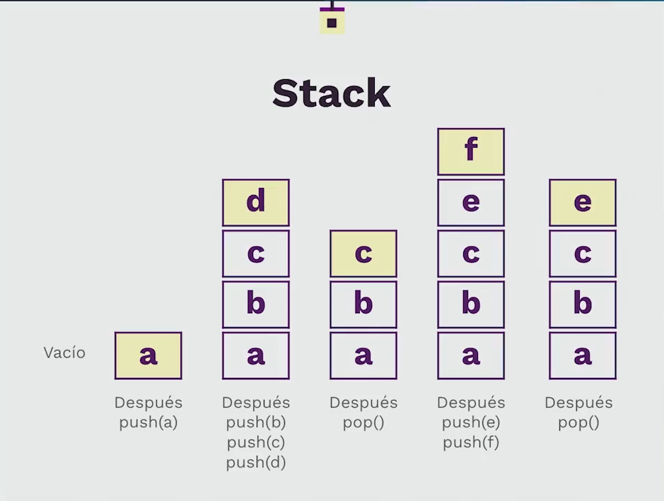

# Music Player
Este es un simple reproductor de música que utiliza una cola basada en nodos para gestionar las pistas de música.

```bash
#podras ver cada canción reproducirse en la terminal
Count 6
Playing white whistle
Playing butter butter
Playing Oh black star
Playing Watch that chicken
Playing Don't go
Playing Fin
```
## Cómo ejecutar el código
Para ejecutar este código, sigue estos pasos:

Asegúrate de tener Python instalado en tu máquina. Este código fue escrito en Python, por lo que necesitarás tenerlo instalado para ejecutarlo.

Descarga el archivo music_player.py y el archivo node_based_queue.py (que contiene la implementación de la cola basada en nodos) en la misma carpeta.

Abre una terminal y navega hasta la carpeta donde descargaste los archivos.

Ejecuta el siguiente comando para ejecutar el código:
```bash
python music_player.py
```
## Cómo funciona
El código define dos clases: Track y MediaPlayerQueue.

La clase Track representa una pista de música. Cada pista tiene un título y una duración aleatoria entre 5 y 6 segundos.

La clase MediaPlayerQueue es una cola que gestiona las pistas de música. Puedes añadir pistas a la cola con el método add_track y reproducir todas las pistas en la cola con el método play.

El código luego crea varias pistas y las añade a la cola del reproductor de música. Finalmente, reproduce todas las pistas en la cola.

## Nota
Este código es solo un ejemplo y no reproduce música real. En su lugar, "reproduce" una pista al imprimir su título y luego pausar la ejecución del programa durante la duración de la pista.


## Suma Piramidal

Este script de Python, `pyramid_sum.py`, contiene una función recursiva `pyramid_sum(lower, upper, margin=0)` que calcula la suma de los enteros desde `lower` hasta `upper`.

## Parámetros de la Función

- `lower`: El límite inferior del rango de enteros a sumar.
- `upper`: El límite superior del rango de enteros a sumar.
- `margin` (opcional): Este parámetro se utiliza para formatear la salida impresa y no forma parte del cálculo de la suma. Por defecto es 0.

## Cómo Funciona

La función funciona llamándose a sí misma recursivamente, incrementando el valor de `lower` en 1 y el de `margin` en 4 cada vez, hasta que `lower` es mayor que `upper`. En este punto, la función devuelve 0, terminando la recursión. La suma de los enteros se calcula sumando `lower` al resultado de la llamada recursiva.

## Salida

La función imprime los valores actuales de `lower` y `upper`, así como la suma actual, cada vez que se llama. El parámetro `margin` se utiliza para indentar la salida, creando una representación visual de la profundidad de la recursión.

## Ejemplo

Ejecutar el script ejecutará la siguiente línea de código:

```python
print(pyramid_sum(1, 10))

1 10
---- 2 10
-------- 3 10
------------ 4 10
---------------- 5 10
-------------------- 6 10
------------------------ 7 10
---------------------------- 8 10
-------------------------------- 9 10
------------------------------------ 10 10
---------------------------------------- 11 10
---------------------------------------- 0
------------------------------------ 10
-------------------------------- 19
---------------------------- 27
------------------------ 34
-------------------- 40
---------------- 45
------------ 49
-------- 52
---- 54
55
55
```
## Colecciones Incorporadas en Python

- **Listas**: Propósito general, de índices con tamaños dinámicos. Ordenables `lista =[]`.
  - Usaría las listas para almacenar una serie de números, una lista de palabras, y básicamente cualquier cosa.

- **Tuplas**: Inmutables, no se pueden añadir más elementos. Útiles para constantes por ejemplo coordenadas, direcciones. Es de tipo secuencial. `tupla =()`.
  - Las usaría cuando sé exactamente el tamaño que tendrán mis datos.

- **Conjuntos**: Almacenan objetos no duplicados (Teoría de conjuntos), son de acceso rápido, aceptan operaciones lógicas, son desordenados. `set() conjunto={1,2,3,4}`.
  - Usaría un casteo entre conjuntos y listas cuando quiero eliminar duplicados de una lista.

- **Diccionarios**: Pares de llave-valor, arrays asociativos (hash maps), son desordenados, y muy rápidos para hacer consultas. `diccionario ={'Llave':"Valor"}`.
  - Los usaría para almacenar datos, listas, objetos que perfectamente pueden volverse un dataframe, o un defaultdict.

## Consideraciones sobre el uso de Colecciones en Python

Es crucial entender cuándo es más apropiado utilizar una colección específica en Python, ya que esto puede afectar tanto el espacio en memoria que ocupa como la eficiencia de ciertas operaciones. Como regla general, se recomienda optar por tuplas en lugar de listas cuando los valores no necesiten ser modificados, ya que las tuplas ocupan menos espacio en memoria. De igual manera, los sets o diccionarios son preferibles para la búsqueda de elementos debido a su mayor velocidad.

Este es un fragmento de código que muestra el tamaño en memoria de las diferentes estructuras de datos en Python:

```python
import sys

collections = {"list": list(), "tuple": tuple(), "dict": dict(), "set": set()}

for name, collection in collections.items():
    print(f'{name} = {sys.getsizeof(collection)} bytes')
```
Resultados:

    list = 56 bytes
    tuple = 40 bytes
    dict = 232 bytes
    set = 216 bytes

## Arrays

Un array es una estructura de datos lineal que representa una colección de elementos. Cada elemento en el array se almacena en una posición específica, conocida como índice. Los arrays son fundamentales en la programación debido a su eficiencia y facilidad de uso. Aquí hay algunos términos clave relacionados con los arrays:

- **Elemento**: Es el valor que se almacena en una posición específica dentro del array.
- **Índice**: Es la referencia numérica a la posición de un elemento en el array. En la mayoría de los lenguajes de programación, los índices de los arrays comienzan en 0, lo que significa que el primer elemento del array se encuentra en el índice 0.

## Almacenamiento y Uso de Arrays

En la memoria, los arrays se almacenan de manera consecutiva, con cada elemento ocupando una posición contigua. Esto permite un acceso rápido a los elementos del array, pero también impone algunas restricciones.

Un array tiene una capacidad de almacenamiento definida en el momento de su creación. Esta capacidad no puede ser modificada posteriormente, lo que significa que no se pueden agregar ni eliminar posiciones una vez que el array ha sido creado.

Los arrays pueden tener una, dos o tres dimensiones. Sin embargo, a medida que aumenta la dimensión del array, se vuelve más complicado acceder a los datos. Por esta razón, en Python se recomienda trabajar con arrays de menos de dos dimensiones.

Es importante destacar que, aunque los arrays son un tipo de lista en Python, las listas no son arrays. Los arrays tienen restricciones adicionales y solo pueden almacenar números y caracteres.

Los arrays se utilizan en diversas aplicaciones, como los sprites en los videojuegos o los menús de opciones. A pesar de las funciones limitadas del módulo `array` en Python, es posible crear arrays personalizados para satisfacer necesidades específicas.

## Clase Array Personalizada

La clase `Array` es una implementación personalizada de un array en Python. Esta clase proporciona varias funcionalidades, incluyendo la capacidad de iterar sobre los elementos del array, acceder a elementos individuales y modificar elementos.

Aquí está la descripción de los métodos de la clase `Array`:

- `__init__(self, capacity, fill_value=None)`: Este método inicializa un nuevo array con una capacidad dada, llenando cada posición con un valor de relleno.

- `__len__(self)`: Este método devuelve la longitud del array.

- `__str__(self)`: Este método devuelve una representación en cadena del array.

- `__iter__(self)`: Este método devuelve un iterador para el array, lo que permite iterar sobre los elementos del array.

- `__getitem__(self, index)`: Este método permite acceder a un elemento del array en una posición específica.

- `__setitem__(self, index, new_item)`: Este método permite modificar el valor de un elemento en una posición específica del array.

Aquí hay un ejemplo de cómo usar la clase `Array`:

```python
my_array = Array(4, 'Hola')
print(my_array, len(my_array), str(my_array), iter(my_array), my_array[0], my_array[1], my_array[2], my_array[3], sep='\n')
```
Print

    ['Hola', 'Hola', 'Hola', 'Hola']
    4
    ['Hola', 'Hola', 'Hola', 'Hola']
    <list_iterator object at 0x7f8f7452b2b0>
    Hola
    Hola
    Hola
    Hola

# Proyecto de Nodos y Procesos

Este proyecto es una demostración simple de cómo se pueden usar los nodos para representar una cadena de procesos. Cada nodo representa un proceso individual y el atributo `next` de cada nodo apunta al siguiente proceso en la cadena.

## Código

El código principal se encuentra en el archivo `node.py`. Aquí está una descripción de lo que hace cada parte del código:

```python
# Create the nodes (processes)
process1 = Node("Start")
process2 = Node("Load data")
process3 = Node("Process data")
process4 = Node("Save results")
process5 = Node("End")
```

Esto crea cinco nodos, cada uno representando un proceso individual en la cadena de procesos.

```python
# Link the nodes
process1.next = process2
process2.next = process3
process3.next = process4
process4.next = process5
```
Esto enlaza los nodos juntos en una cadena. El atributo next de cada nodo apunta al siguiente nodo en la cadena.

```python
# Print the process chain
current_node = process1
while current_node is not None:
    print(current_node.data)
    current_node = current_node.next
```
Esto imprime cada proceso en la cadena en orden. Comienza con el primer nodo y sigue los enlaces next hasta que llega al final de la cadena.

```bash
# Terminal
------------------------------
Start
Load data
Process data
Save results
End
------------------------------
```  
Este proyecto es una forma simple pero efectiva de demostrar cómo se pueden usar los nodos para representar una cadena de procesos. Puede ser útil para entender conceptos como las listas enlazadas y las estructuras de datos basadas en nodos.

## `link_list.py` Implementación de Lista Enlazada Simple

Este código implementa una lista enlazada simple en Python. Cada nodo en la lista contiene datos y un puntero al siguiente nodo en la lista. La lista mantiene un seguimiento de su cola (el primer nodo agregado) y su tamaño (el número de nodos).

### Métodos de la Clase

- `__init__`: Inicializa una nueva lista vacía.
- `append(data)`: Agrega un nuevo nodo con los datos dados al final de la lista.
- `get_size()`: Devuelve el número de nodos en la lista.
- `iter()`: Devuelve un generador que itera sobre los nodos en la lista.
- `delete(data)`: Elimina el primer nodo en la lista que contiene los datos dados.
- `search(data)`: Busca un nodo que contenga los datos dados e imprime un mensaje si se encuentra.
- `clear()`: Elimina todos los nodos de la lista.

### Ejemplo de Uso

El código incluye un ejemplo de cómo crear una lista de reproducción utilizando la lista enlazada. Las canciones se agregan a la lista de reproducción con `append`, y la canción actual se mantiene con una variable separada. La función `print_playlist_and_current_song` imprime todas las canciones en la lista de reproducción y la canción actual.

```python
playlist = SinglyLinkedList()
playlist.append('Canción 1')
playlist.append('Canción 2')
playlist.append('Canción 3')
cancion_actual = playlist.tail

def print_playlist_and_current_song(playlist, cancion_actual):
    print("Lista de reproducción:")
    for song in playlist.iter():
        print(song)

    print("\nCanción actual:")
    print(cancion_actual.data)

print_playlist_and_current_song(playlist, cancion_actual)
```
```bash
# Terminal
  Playlist:
  Song 1
  Song 2
  Song 3

  Current song:
  Song 1
  ------------------------------
  Song 1
  Song 2
  Song 3
  Data Song 3 found!
```

El código también incluye ejemplos comentados de cómo eliminar una canción de la lista de reproducción con `delete`, limpiar la lista de reproducción con `clear`, iterar sobre las canciones en la lista de reproducción con `iter`, y buscar una canción en la lista de reproducción con `search`.

# Implementación de Lista Doble Enlazada en Python

Este repositorio contiene una implementación simple de una lista doblemente enlazada en Python. El código define dos clases: `Node` y `TowWayNode`.

## Clase Node

La clase `Node` representa un solo nodo en una lista enlazada simple. Cada nodo tiene dos atributos:

- `data`: Los datos almacenados en el nodo.
- `next`: El siguiente nodo en la lista.

Aquí está el código para la clase `Node`:

```python
class Node(object):
    def __init__(self, data, next=None):
        self.data = data
        self.next = next
```

## Clase TowWayNode
La clase TowWayNode extiende la clase Node para crear un nodo para una lista doblemente enlazada. Además de los atributos data y next de la clase Node, un TowWayNode también tiene un atributo previous, que apunta al nodo anterior en la lista.

Aquí está el código para la clase TowWayNode:
```python
class TowWayNode(Node):
    def __init__(self, data, previous=None, next=None):
        Node.__init__(self, data, next)
        self.previous = previous
```
Las listas doblemente enlazadas son útiles en muchas situaciones en las que se necesita una estructura de datos flexible y eficiente. Permiten la inserción y eliminación eficiente de elementos en ambas direcciones, lo que las hace ideales para ciertos tipos de problemas de manipulación de datos. Además, al mantener referencias tanto al nodo anterior como al siguiente, las listas doblemente enlazadas facilitan la navegación y manipulación de la lista en ambas direcciones.

## Ejemplo de Uso

Aquí hay un ejemplo de cómo puedes usar estas clases para crear una lista doblemente enlazada:

```python
# Crear nodos
node1 = TowWayNode("data1")
node2 = TowWayNode("data2")
node3 = TowWayNode("data3")

# Enlazar nodos
node1.next = node2
node2.previous = node1
node2.next = node3
node3.previous = node2

# Ahora tenemos una lista doblemente enlazada con 3 nodos
# Podemos recorrerla en ambas direcciones
current_node = node1
while current_node is not None:
    print(current_node.data)
    current_node = current_node.next

current_node = node3
while current_node is not None:
    print(current_node.data)
    current_node = current_node.previous

# Terminal

data1
data2
data3
data3
data2
data1
```

## Stack
Un stack (o pila) es una estructura de datos que sigue la regla "último en entrar, primero en salir" (LIFO, por sus siglas en inglés). Imagina una pila de platos: puedes poner un nuevo plato en la parte superior (esto se llama "push") y sólo puedes quitar el plato que está en la parte superior (esto se llama "pop"). No puedes quitar un plato que esté en medio de la pila sin quitar primero los platos que están encima. Eso es básicamente cómo funciona un stack en programación.



# Stack Class

La clase `Stack` es una implementación de una pila en Python. Una pila es una estructura de datos que sigue el principio de "último en entrar, primero en salir" (LIFO). 

Aquí hay un ejemplo de cómo usar la clase `Stack`:

```python
food = Stack()
food.push('apple')
food.push('banana')
food.push('cherry')
```
En este ejemplo, creamos una nueva pila llamada food y agregamos tres elementos a la pila ('apple', 'banana', y 'cherry').
```python
print(f'food.pop() : ', food.pop())  # Output: cherry
print(f'food.peek() : ', food.peek())  # Output: banana
food.clear()  # This will clear the stack Output: None
```

El método `pop` elimina el elemento superior de la pila y lo devuelve. En este caso, imprime 'cherry', que es el último elemento que agregamos a la pila.

El método `peek` devuelve el elemento superior de la pila sin eliminarlo. En este caso, imprime 'banana', que es ahora el elemento superior de la pila después de haber eliminado 'cherry'.

El método `clear` elimina todos los elementos de la pila. Después de llamar a este método, la pila food está vacía.

# README para stack_based_queue.py

## Descripción

El archivo `stack_based_queue.py` contiene una implementación de una cola utilizando dos pilas. Esta es una técnica común en ciertas situaciones de programación para implementar una cola con las propiedades de "primero en entrar, primero en salir" (FIFO) utilizando pilas que tienen la propiedad de "último en entrar, primero en salir" (LIFO).

## Class Queue

La clase `Queue` tiene dos atributos principales: `inbound_stack` y `outbound_stack`, que son listas que actúan como nuestras dos pilas.

- `inbound_stack` se utiliza para almacenar nuevos elementos que se agregan a la cola.
- `outbound_stack` se utiliza para eliminar elementos de la cola.

La clase `Queue` tiene dos métodos principales:

- `enqueue(self, data)`: Este método toma un argumento `data` y lo agrega a `inbound_stack`, efectivamente agregándolo al final de la cola.

- `dequeue(self)`: Este método no toma argumentos y elimina y devuelve el elemento que está al frente de la cola. Si `outbound_stack` está vacío, todos los elementos de `inbound_stack` se mueven a `outbound_stack`, invirtiendo el orden de los elementos. Luego, el elemento superior de `outbound_stack` se desapila y se devuelve.

## Ejemplo de uso

El archivo `stack_based_queue.py` también contiene un ejemplo de cómo usar la clase `Queue`. En este ejemplo, se crea una nueva instancia de `Queue` llamada `numbers`, y luego se agregan los números 5, 6 y 7 a la cola. Luego, se imprime el estado de `inbound_stack`, se elimina un elemento de la cola y se imprimen los estados de `inbound_stack` y `outbound_stack` después de la operación de eliminación.

## node_based_queue.py

## Descripción

El archivo `node_based_queue.py` contiene una implementación de una cola utilizando nodos enlazados. Esta es una técnica común en ciertas situaciones de programación para implementar una cola con las propiedades de "primero en entrar, primero en salir" (FIFO) utilizando una lista enlazada.

## Clase Queue

La clase `Queue` tiene tres atributos principales: `head`, `tail` y `count`.

- `head` es el primer nodo en la cola.
- `tail` es el último nodo en la cola.
- `count` es el número de nodos en la cola.

La clase `Queue` tiene dos métodos principales:

- `enqueue(self, data)`: Este método toma un argumento `data` y lo agrega al final de la cola, creando un nuevo nodo con `data` y ajustando los enlaces de los nodos y `tail` según sea necesario.

- `dequeue(self)`: Este método no toma argumentos y elimina y devuelve el elemento que está al frente de la cola. Ajusta los enlaces de los nodos y `head` según sea necesario.

## Ejemplo de uso

El archivo `node_based_queue.py` también contiene un ejemplo de cómo usar la clase `Queue`. En este ejemplo, se crea una nueva instancia de `Queue` llamada `food`, y luego se agregan 'eggs', 'ham' y 'spam' a la cola. Luego, se imprimen varios atributos de la cola, como `head.data`, `tail.data`, `count`, `head.next.data`, y `tail.previous.data`.